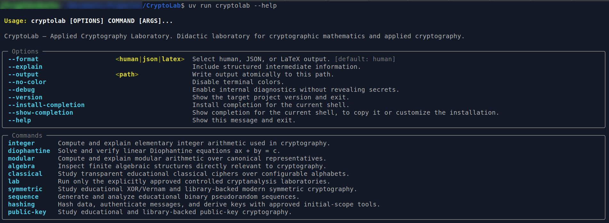

# CryptoLab — Applied Cryptography Laboratory

CryptoLab is a public, didactic, reproducible, and technically rigorous laboratory that
connects cryptographic mathematics with transparent educational implementations and the
correct use of modern cryptographic libraries.

CryptoLab is designed to demonstrate knowledge of theoretical and applied cryptography
without becoming a complete cryptographic suite, a production cryptographic library, or a
general-purpose security product.

<p align="center">
  
</p>

> **Release model**
>
> CryptoLab uses one initial public release: **version 1.0.0**. No public pre-release is
> planned. Git history before the `v1.0.0` tag is development history; the validated tag and
> its distributions define the public release.

## Project actions

CryptoLab is summarized by six actions:

- **COMPUTE** mathematical operations used in cryptography.
- **IMPLEMENT** transparent educational algorithms and correct library-backed operations.
- **VISUALIZE** intermediate states, tables, transformations, and protocol flows.
- **VALIDATE** results using tests, identities, and published vectors.
- **COMPARE** algorithms according to purpose, properties, assumptions, and limitations.
- **EXPLAIN** what each construction provides, how it works, and how it can fail.

## What CryptoLab is

CryptoLab is:

- an educational applied-cryptography laboratory;
- a bridge between cryptographic mathematics and modern APIs;
- a command-line project with structured, scriptable output;
- a collection of reproducible examples and controlled local laboratories;
- a public demonstration of mathematical, cryptographic, software, testing, and
  documentation skills.

## What CryptoLab is not

CryptoLab is not:

- a replacement for OpenSSL, `cryptography`, or PyCryptodome;
- a production key-management system;
- a TLS, PKI, or certificate implementation;
- a network scanner, proxy, pentesting framework, or attack platform;
- a web application, desktop application, cloud service, database application, or IoT
  system;
- a formally verified or independently audited cryptographic library.

## Implementation categories

Every public capability belongs to one of four categories:

- `educational`: transparent code intended for study and inspection;
- `library-backed`: modern cryptographic operations delegated to established libraries;
- `controlled-laboratory`: deliberately vulnerable local demonstrations approved by the
  project scope;
- `comparison`: structured contrasts between algorithms and constructions.

Educational code may expose intermediate values and is not necessarily constant-time or
suitable for protecting real data. Modern primitives are not reimplemented merely to
increase repository size.

## Version 1.0.0 scope

The complete initial scope includes:

### Cryptographic mathematics

- integer and natural-number conventions;
- Euclidean division;
- divisibility and divisor enumeration;
- prime and composite classification;
- bounded educational primality testing and factorization;
- greatest common divisor and least common multiple;
- Euclidean and extended Euclidean algorithms;
- Bézout identities;
- linear Diophantine equations;
- modular arithmetic, inverses, zero divisors, exponentiation, linear congruences, and the
  generalized Chinese Remainder Theorem;
- semigroups, monoids, groups, cyclic groups, rings, integral domains, fields, orders,
  generators, and primitive roots where directly relevant to cryptography.

### Classical cryptography and sequences

- Caesar, Vigenère, and Polybius ciphers;
- configurable alphabets;
- XOR, Vernam, and One-Time Pad requirements;
- Fibonacci LFSRs with one explicit convention;
- period, cycle detection, balance, runs, and basic periodic autocorrelation.

### Modern symmetric cryptography

- AES-128 and AES-256;
- ECB, CBC, CFB-128, OFB, CTR, GCM, and XTS;
- ChaCha20-Poly1305;
- correct handling of keys, IVs, nonces, counters, tweaks, associated data, tags, and
  padding;
- explicit security and misuse warnings.

### Hashing, authentication, and derivation

- SHA-256 and SHA3-256;
- HMAC-SHA-256;
- HKDF-SHA-256;
- file hashing, digest comparison, published vectors, and avalanche visualization.

### Public-key cryptography

- educational textbook RSA;
- RSA-OAEP and RSA-PSS through an established library;
- educational finite-field Diffie-Hellman;
- educational elliptic-curve arithmetic over small prime fields;
- X25519 with HKDF-based derivation;
- Ed25519 signing and verification.

### Controlled cryptanalysis laboratories

Version 1.0.0 contains exactly these four laboratories:

1. Caesar brute force;
2. Vernam key reuse;
3. ECB pattern leakage;
4. unauthenticated Diffie-Hellman man-in-the-middle.

All laboratory code operates only on project-generated data, repository fixtures, or
intentionally vulnerable local examples.

### Validation and comparison

- unit, integration, round-trip, boundary, invalid-input, and selected property-based tests;
- mathematical identity verification;
- selected NIST and RFC test vectors;
- optional direct SageMath cross-validation for supported educational calculations;
- comparisons between educational and library-backed code, AES modes, AEAD constructions,
  hash and authentication mechanisms, finite-field and elliptic-curve key agreement, and
  RSA and Ed25519 signatures.

## Mathematical conventions

CryptoLab uses the following fixed conventions:

- `N = {1, 2, 3, ...}` and `N0 = {0, 1, 2, ...}`;
- Euclidean division returns the unique `q` and `r` satisfying `a = bq + r` and
  `0 <= r < |b|`;
- `gcd(a, b)` is always non-negative and `gcd(0, 0) = 0`;
- modular representatives belong to `{0, ..., n - 1}` with `n >= 2`;
- zero is excluded from the project's list of non-zero zero divisors;
- integer-to-byte conversion is unsigned, big-endian, and minimal unless a length is
  explicitly requested;
- text is encoded as UTF-8 with strict error handling;
- hexadecimal input uses an even number of characters with no prefix or separators.

These conventions must not change silently.

## Implemented version 1.0.0 capabilities

The version 1.0.0 implementation includes:

- Euclidean division;
- divisibility and complete divisor enumeration;
- gcd, lcm, Euclidean traces, extended gcd, and Bézout coefficients;
- bounded deterministic educational primality testing and factorization;
- complete solution classification for linear Diophantine equations;
- equivalent-equation reduction and candidate-solution verification;
- canonical modular arithmetic;
- fast modular exponentiation with structured traces;
- units, multiplicative inverses, and non-zero zero divisors;
- linear congruences with every canonical solution;
- the generalized Chinese Remainder Theorem for compatible non-coprime moduli;
- structural analysis of `Z_n`, element orders, generated subgroups, generators, and
  primitive roots modulo a prime;
- strict configurable alphabets with built-in Latin and Spanish uppercase data;
- Caesar encryption, decryption, tables, complete key enumeration, and frequency counts;
- Vigenère encryption, decryption, and repeated-key alignment;
- Polybius grid construction, canonical coordinate tokens, encryption, decryption, and
  coordinate validation;
- XOR truth tables, equal-length bitwise and bytewise XOR, and explicit byte sources;
- educational Vernam encryption and decryption plus strict One-Time Pad requirements;
- Fibonacci right-shift LFSRs with one fixed polynomial, state, bit-ordering, and output
  convention;
- period detection, state tables, register diagrams, balance, cyclic runs, and periodic
  autocorrelation;
- controlled Caesar brute-force, Vernam key-reuse, and AES-ECB pattern-leakage laboratories;
- library-backed AES-128 and AES-256 operations in ECB, CBC, CFB-128, OFB, CTR, GCM, and
  XTS modes;
- explicit PKCS#7 padding, IV, initial-counter-block, nonce, tweak, AAD, and tag handling;
- library-backed ChaCha20-Poly1305 authenticated encryption;
- contextual AES-mode and AEAD comparison tables;
- library-backed SHA-256 and SHA3-256 over UTF-8 text, canonical hexadecimal bytes, and
  incrementally processed files;
- full digest verification, SHA-2 versus SHA-3 comparison, and byte-level avalanche
  visualization;
- HMAC-SHA-256 generation and constant-time verification plus hash-versus-MAC comparison;
- staged HKDF-SHA-256 extraction and expansion with PRK, info, OKM, RFC vectors, and a
  complete-derivation cross-check;
- educational textbook RSA with manual or generated small primes, Euler totient,
  Carmichael function, Euler- and Carmichael-based private exponents, CRT parameters,
  modular traces, and direct/CRT decryption cross-checks;
- unsigned big-endian integer/byte conversion for RSA teaching examples;
- library-backed RSA key generation, PKCS#8 and SubjectPublicKeyInfo PEM serialization,
  RSA-OAEP encryption/decryption, and RSA-PSS signing/verification;
- contextual RSA construction, key-direction, message-size, and hybrid-encryption
  comparisons;
- educational finite-field Diffie-Hellman over small prime fields, including generator
  validation, public-value orders, shared-secret computation, and HKDF-SHA-256 derivation;
- the controlled unauthenticated Diffie-Hellman man-in-the-middle laboratory, completing
  the exact four-laboratory registry;
- educational short-Weierstrass elliptic curves over tiny prime fields with point
  enumeration, infinity, negation, addition, doubling, scalar multiplication, point order,
  and generated subgroups;
- library-backed X25519 key generation, two-party shared-secret computation,
  all-zero rejection, HKDF-SHA-256 derivation, and finite-field DH comparison;
- library-backed Ed25519 key generation, deterministic signing, verification, and
  RSA-PSS/HMAC comparison;
- human, JSON, and LaTeX output;
- unit, integration, CLI, and property-based tests for the implemented domain.

The complete approved scope is implemented. The public release is created only from the
validated commit that receives the annotated `v1.0.0` tag.

## Requirements

- Linux;
- Python 3.12 or newer;
- `uv` for dependency management, execution, locking, and builds;
- the `cryptography` package for modern library-backed primitives.

Installing, developing, testing, and releasing CryptoLab do not require SageMath. SageMath
is available only as an optional direct cross-validation path for selected educational
calculations. The normal wheel and CLI remain independent of SageMath.

Python 3.12, 3.13, and 3.14 are the intended Python CI matrix for version 1.0.0.

## Installation for development

```bash
cd /home/jfcrypt/Documents/Proyectos/CryptoLab
uv sync
```

Install the pre-commit hooks after the directory is a Git repository. A cloned repository already satisfies this requirement. For a source archive, initialize Git first:

```bash
git init -b main
uv run pre-commit install
```

## Quick start

Display the root help:

```bash
uv run cryptolab --help
```

Perform Euclidean division:

```bash
uv run cryptolab --explain integer divide -17 5
```

Expected mathematical result:

```text
-17 = 5(-4) + 3
0 <= 3 < 5
```

Use a negative divisor while preserving the same remainder convention:

```bash
uv run cryptolab --format json integer divide -17 -5
```

Compute an extended gcd:

```bash
uv run cryptolab --explain integer extended-gcd 250 110
```

Factor a small educational integer:

```bash
uv run cryptolab integer factor -92400
```

Solve a linear Diophantine equation:

```bash
uv run cryptolab --explain diophantine solve 33 17 1
```

Solve a linear congruence:

```bash
uv run cryptolab --explain modular solve-linear 15 30 55
```

Solve a generalized CRT system:

```bash
uv run cryptolab --explain modular crt \
  --congruence 5:7 \
  --congruence 0:6 \
  --congruence=-1:5
```

Inspect algebraic structure and primitive roots:

```bash
uv run cryptolab --explain algebra zn 15
uv run cryptolab --explain algebra primitive-roots 17
```

Encrypt and decrypt with a configurable Caesar alphabet:

```bash
uv run cryptolab classical caesar encrypt PARABOLOIDE 9 --alphabet spanish-upper
uv run cryptolab classical caesar decrypt YJAJKXTXQMN 9 --alphabet spanish-upper
```

Inspect Vigenère key alignment:

```bash
uv run cryptolab --explain classical vigenere encrypt ATTACKATDAWN LEMON
```

Build and use a Polybius grid:

```bash
uv run cryptolab classical polybius build --alphabet spanish-upper
uv run cryptolab classical polybius encrypt "ABC D"
uv run cryptolab classical polybius decrypt "11 12 13 u+20 14"
```

Inspect XOR and reproduce the Vernam teaching example:

```bash
uv run cryptolab symmetric xor truth-table
uv run cryptolab symmetric xor bits 1011 1111
uv run cryptolab --explain symmetric vernam encrypt \
  --message-hex beca \
  --key-hex fe12
uv run cryptolab symmetric vernam decrypt \
  --ciphertext-hex 40d8 \
  --key-hex fe12
```

Generate and analyze an LFSR sequence under the fixed CryptoLab convention:

```bash
uv run cryptolab --explain sequence lfsr diagram "x^3+x^2+1"
uv run cryptolab --explain sequence lfsr period "x^3+x^2+1" 101
uv run cryptolab sequence lfsr generate "x^3+x^2+1" 101 21
uv run cryptolab --explain sequence analyze 1010011 --max-lag 6
```

Use modern library-backed symmetric cryptography:

```bash
uv run cryptolab symmetric aes encrypt cbc \
  --key-hex 2b7e151628aed2a6abf7158809cf4f3c \
  --iv-hex 000102030405060708090a0b0c0d0e0f \
  --padding pkcs7 \
  --plaintext-text "CryptoLab"

uv run cryptolab symmetric aes encrypt gcm \
  --key-hex 00000000000000000000000000000000 \
  --nonce-hex 000000000000000000000000 \
  --plaintext-hex 00000000000000000000000000000000 \
  --aad-text "header"

uv run cryptolab symmetric chacha20-poly1305 encrypt \
  --key-hex 0000000000000000000000000000000000000000000000000000000000000000 \
  --nonce-hex 000000000000000000000000 \
  --plaintext-text "message" \
  --aad-text "header"

uv run cryptolab symmetric aes compare-modes
uv run cryptolab symmetric compare-aead
```

Use hashing, HMAC, and HKDF:

```bash
uv run cryptolab hashing digest sha256 --message-text "abc"
uv run cryptolab hashing digest sha3-256 --message-file artifact.bin
uv run cryptolab --explain hashing avalanche sha256 \
  --left-text "abc" \
  --right-text "abd"

uv run cryptolab hashing hmac-sha256 generate \
  --key-text "shared key" \
  --message-text "authenticated message"

uv run cryptolab --explain hashing hkdf-sha256 derive \
  --ikm-text "shared secret" \
  --salt-text "CryptoLab salt" \
  --info-text "session key" \
  --length 32

uv run cryptolab hashing compare-hashes
uv run cryptolab hashing compare-hash-mac
```

Inspect educational RSA and use library-backed RSA:

```bash
uv run cryptolab --explain public-key rsa educational inspect 61 53 17
uv run cryptolab public-key rsa educational encrypt 65 --p 61 --q 53 --e 17
uv run cryptolab --explain public-key rsa educational decrypt 2790 --p 61 --q 53 --e 17

uv run cryptolab public-key rsa applied generate \
  --key-size 2048 \
  --private-key-out private.pem \
  --public-key-out public.pem

uv run cryptolab public-key rsa applied oaep-encrypt \
  --public-key-file public.pem \
  --plaintext-text "session key material"

uv run cryptolab public-key rsa applied pss-sign \
  --private-key-file private.pem \
  --message-text "CryptoLab"

uv run cryptolab --explain public-key rsa compare
```

Inspect educational finite-field Diffie-Hellman and derive a session key:

```bash
uv run cryptolab --explain public-key dh group 17 3
uv run cryptolab --explain public-key dh exchange 17 3 13 11
```

Inspect educational elliptic-curve arithmetic:

```bash
uv run cryptolab --explain public-key ecc inspect 17 2 2
uv run cryptolab --explain public-key ecc add 17 2 2 5:1 5:1
uv run cryptolab --explain public-key ecc multiply 17 2 2 3 5:1
uv run cryptolab --explain public-key ecc subgroup 17 2 2 5:1
```

Generate X25519 and Ed25519 keys and inspect the required comparisons:

```bash
uv run cryptolab public-key x25519 generate \
  --private-key-out x25519-private.pem \
  --public-key-out x25519-public.pem

uv run cryptolab public-key ed25519 generate \
  --private-key-out ed25519-private.pem \
  --public-key-out ed25519-public.pem

uv run cryptolab public-key ed25519 sign \
  --private-key-file ed25519-private.pem \
  --message-text "CryptoLab"

uv run cryptolab --explain public-key compare-key-agreement
uv run cryptolab --explain public-key compare-signatures
```

Run the implemented controlled laboratories:

```bash
uv run cryptolab lab caesar-brute-force KHOOR
uv run cryptolab --explain lab vernam-key-reuse \
  --message-one-hex beca \
  --message-two-hex bcee \
  --key-hex fe12
uv run cryptolab --explain lab ecb-pattern-leakage \
  --key-hex 000102030405060708090a0b0c0d0e0f \
  --plaintext-hex \
00112233445566778899aabbccddeeff0000000000000000000000000000000000112233445566778899aabbccddeeff

uv run cryptolab --explain lab dh-man-in-the-middle \
  17 3 13 11 \
  --mallory-alice-private 5 \
  --mallory-bob-private 7
```

## Output formats

The root CLI supports:

```text
--format human|json|latex
--explain
--output PATH
--no-color
--debug
--version
```

JSON output is designed for scripting and keeps human warnings out of standard output.
LaTeX output is available only for commands with a meaningful mathematical
representation.

## Testing and quality

Run the complete test suite:

```bash
uv run pytest
```

Run linting and formatting checks:

```bash
uv run ruff check .
uv run ruff format --check .
```

Run strict static typing:

```bash
uv run mypy
```

Run all pre-commit checks:

```bash
uv run pre-commit run --all-files --show-diff-on-failure
```

Run the repository-owned release-readiness checker:

```bash
uv run python scripts/check_release.py
```

Build the wheel and source distribution, then validate their contents:

```bash
uv build --no-sources
uv run python scripts/check_release.py --dist-dir dist
```

Optionally compare one supported educational calculation with SageMath:

```bash
source /home/jfcrypt/miniforge3/bin/activate sage

uv run python scripts/cross_validate.py -- \
  modular inverse 13 200
```

Without cross-validation, the corresponding normal CLI command is:

```bash
uv run cryptolab modular inverse 13 200
```

The user supplies the operation and parameters once. The coordinator executes the real
CryptoLab CLI, runs `sagemath/compute_reference.py` with the same normalized inputs, and
compares both results. Use `--list-supported` to inspect the current mappings.

Build the documentation strictly:

```bash
uv run mkdocs build --strict
```

## Documentation

`README.md` is the complete self-contained entry point for the repository. The `docs/`
directory provides the detailed mathematical, cryptographic, laboratory, comparison, and
validation manual through MkDocs. The consolidated release pages are:

- [`docs/foundations/cryptographic-foundations.md`](docs/foundations/cryptographic-foundations.md);
- [`docs/comparisons/required-comparisons.md`](docs/comparisons/required-comparisons.md);
- [`docs/validation/release-traceability.md`](docs/validation/release-traceability.md);
- [`docs/validation/release-acceptance.md`](docs/validation/release-acceptance.md);
- [`docs/release-process.md`](docs/release-process.md).

Optional direct SageMath cross-validation is documented in
[`docs/validation/sagemath-cross-validation.md`](docs/validation/sagemath-cross-validation.md)
and [`sagemath/README.md`](sagemath/README.md). SageMath remains isolated from the normal
runtime package and does not block mandatory CI or release acceptance.

The generated MkDocs documentation is published through GitHub Pages at
[`https://jfcrypt.github.io/CryptoLab/`](https://jfcrypt.github.io/CryptoLab/).

CryptoLab itself is not a web application. GitHub Pages serves only the generated static
documentation, and no cryptographic operation is executed remotely.

## Security statement

CryptoLab makes no claim of:

- certification;
- formal verification;
- independent security auditing;
- universal production readiness;
- complete side-channel resistance;
- unconditional security.

Do not use educational implementations to protect sensitive information. See
[`SECURITY.md`](SECURITY.md) for the reporting policy and project limitations.

## Repository policy

All repository content is written in English, including source code, identifiers, comments,
docstrings, tests, CLI output, documentation, workflows, commits, issues, and releases.
Configurable alphabet symbols are data and may contain non-English characters.

## Contributing

Contributions must preserve the approved scope, mathematical conventions, implementation
categories, English-only repository policy, test coverage, and limited cryptanalysis model.
See [`CONTRIBUTING.md`](CONTRIBUTING.md).

## Citation

Citation metadata is provided in [`CITATION.cff`](CITATION.cff).

## License

CryptoLab is released under the MIT License. See [`LICENSE`](LICENSE).
