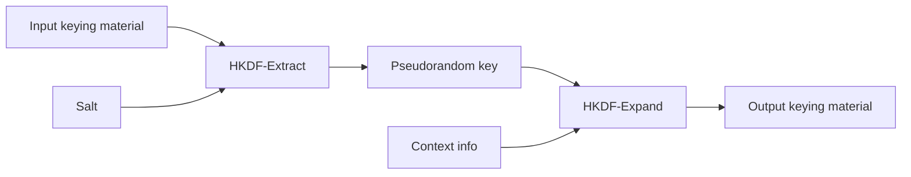

# HKDF-SHA-256

HKDF is an HMAC-based extract-and-expand key derivation function. CryptoLab uses SHA-256 and
exposes both RFC 5869 stages.



## Derive key material

```bash
cryptolab --explain hashing hkdf-sha256 derive \
  --ikm-hex 0b0b0b0b0b0b0b0b0b0b0b0b0b0b0b0b0b0b0b0b0b \
  --salt-hex 000102030405060708090a0b0c \
  --info-hex f0f1f2f3f4f5f6f7f8f9 \
  --length 42
```

CryptoLab requires non-empty input keying material for this didactic interface.

The command exposes:

- IKM length and source;
- whether a salt was explicitly supplied;
- the effective salt;
- PRK from Extract;
- application-specific `info`;
- requested output length;
- OKM from Expand;
- an independent complete-HKDF cross-check.

## Salt and info

Salt is optional but explicit salt use is generally preferable when a protocol defines it. When
salt is omitted, RFC 5869 defines the effective salt as a string of `HashLen` zero octets. For
SHA-256 this is 32 zero bytes.

`info` binds derived output to application or protocol context. It is not a salt and is not
required to be secret. CryptoLab defaults it to the empty byte string when it is omitted.

## Limits and exclusions

SHA-256 has `HashLen = 32` bytes, so RFC 5869 limits one Expand operation to at most
`255 * 32 = 8160` output bytes. CryptoLab enforces the range `1..8160`.

HKDF is intended for key material such as a Diffie-Hellman shared secret. It is not a password-
hashing function and CryptoLab does not present it as one.

## Later integration

The finite-field Diffie-Hellman and X25519 milestones MUST use this same HKDF-SHA-256 module
to derive session keys from shared secrets. This preserves one implementation and one set of
salt, info, length, and encoding conventions.

## Validation

The automated tests include RFC 5869 SHA-256 test cases, including explicit and omitted salt.
Extract is computed with Python HMAC, Expand with `cryptography` `HKDFExpand`, and the result
is cross-checked with the complete `cryptography` HKDF operation.
